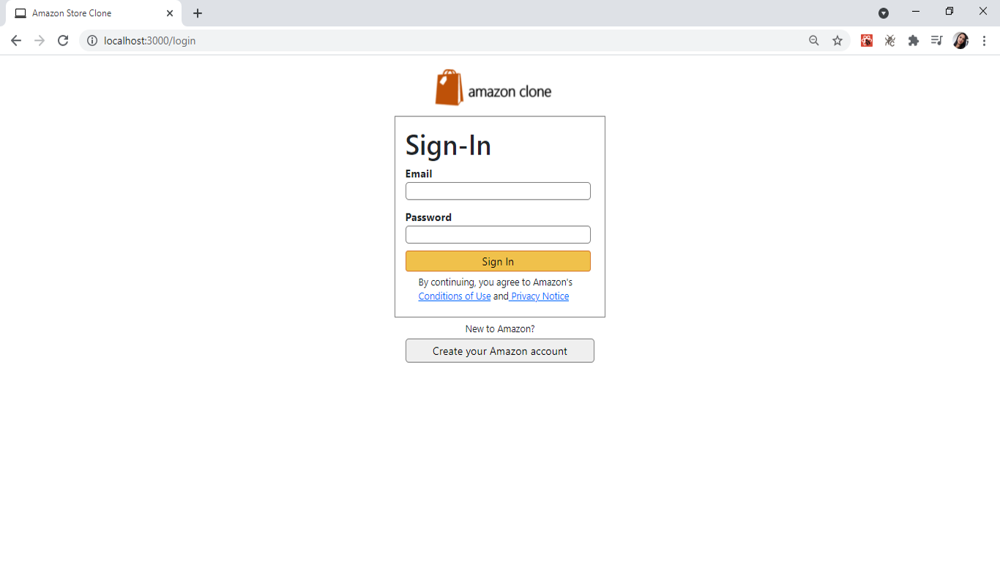
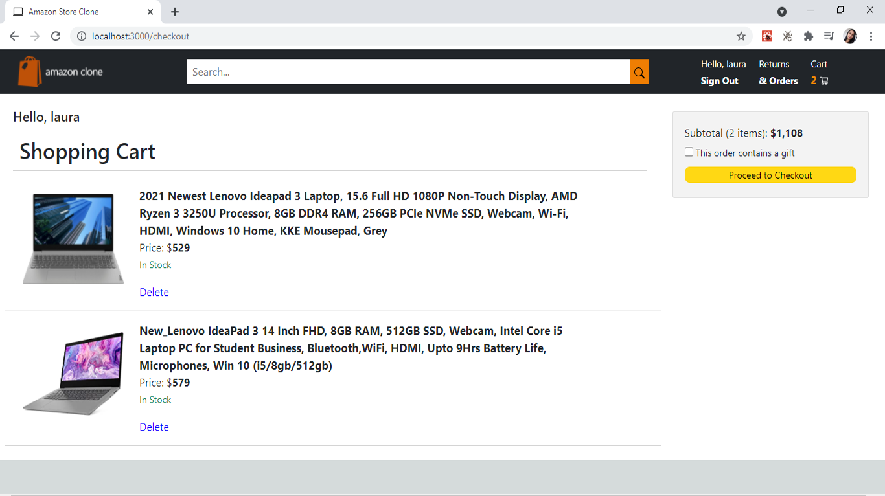
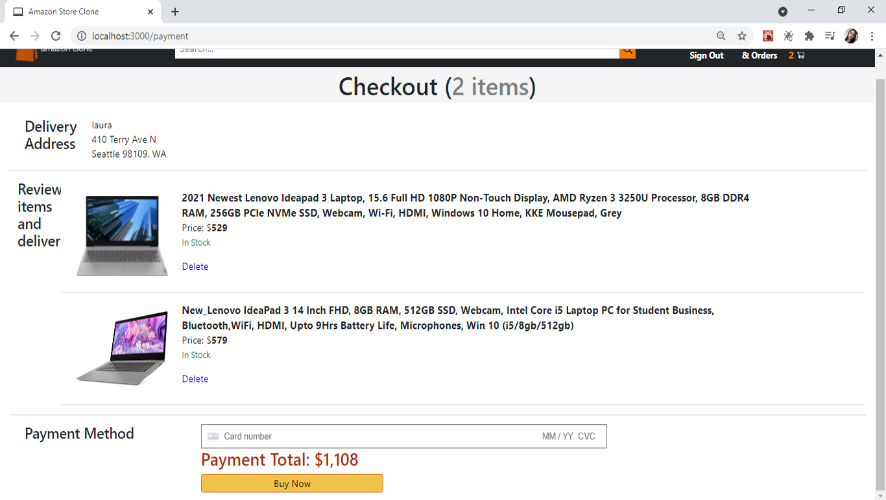
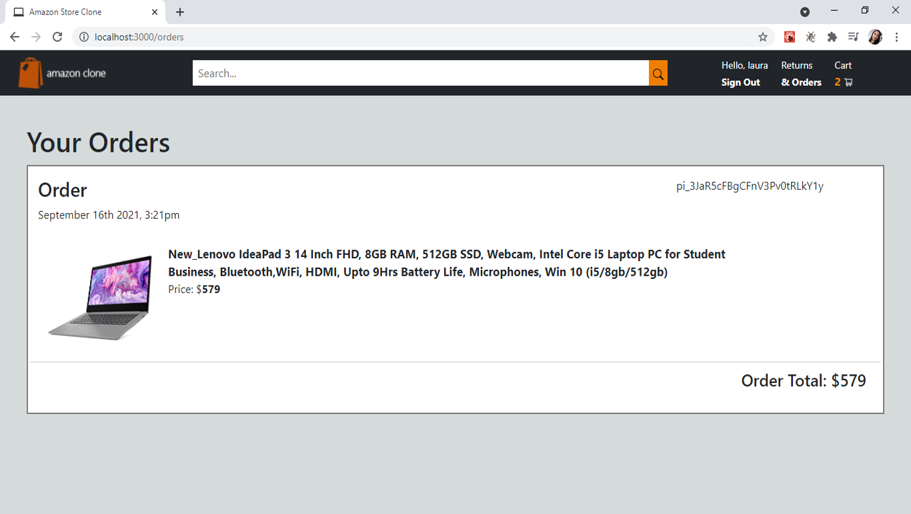

# Amazon Clone
Amazon Clone is an imitation of the Amazon website with basic functionalities such as: SignUp, SignIn, SignOut, show products, add products to the shopping cart, Add the total of purchase items, payment of purchases, creation and summary of orders shopping.

## Features
### Show products, Add products to the shopping cart


### Sign Up, Sign In, Sign Out


### Summary of shopping cart, Total of purchase items


### Payment


### Summary of orders purchases



## Requirements
- To run the program you will need **node** and **npm** installed globally on your machine.

## Instructions

### Clone repository
To clone the repository, you must type the following command:
```
$ git clone https://github.com/yulyzulu/amazon-clone.git
```

### Installation

In your console you need to enter to amazon-clone directory, and you must execute the following command:

```
$ npm install
```
This command will download the packages necessary to run the program.

### Execution
In the amazon-clone directory open two terminals, in one type the following command:
```
$ npm run start
```
and in the other terminal type the following command to execute the program.
```
$ firebase emulators:start
```

### Interaction
Now you can interact with the application, add products to the shopping cart, delete them, pay and see your orders.

## Technologies
- ReactJs: React is a JavaScript library created for building fast and interactive user interfaces for web and mobile applications.
- Firebase: Google Firebase is a Google-backed application development software that enables developers to develop iOS, Android and Web apps.
- Bootstrap: Bootstrap is the most popular CSS Framework for developing responsive and mobile-first websites.
- Stripe: Stripe is a suite of payment APIs that powers commerce for online businesses of all sizes, including fraud prevention, and subscription management.


## Author
- Yulieth Zuluaga [Github](https://github.com/yulyzulu) [LinkedIn](https://www.linkedin.com/in/yuliethzuluaga/)